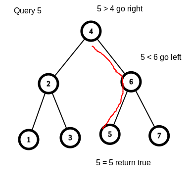
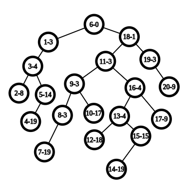

# 一文搞懂 FHQ Treap

前置知识：二叉搜索树，堆

## 引入

我们在普及组都学过BST（二叉搜索树），先简单温习一下BST的定义

二叉搜索树的每个结点，都比它的左结点的权值大，都比它的右结点的权值小

通过维护这种性质，我们最多从树的根查找到树的底部，就能插入或查询到我们需要的值，即查询的时间复杂度为$O(h)$，$h$为树的高度，所以在理想情况下，即树的高度最小的时候，复杂度为$O(log n)$



如上，这次查询比较了3次

但是，这种朴素的数据结构存在缺陷，下面我们来对一个BST插入一串单调的数列：1,2,3,4,5


如图，这样树就退化成了一条链，比较了5次，每次查询的时间复杂度就退化成了$O(n)$

$Treap$ 这一类平衡树的目的就是尽可能减小树的高度，使时间复杂度维持在$O(log n)$

## 概述

在普及组中，我们还学过堆，二叉堆通过维护每一个结点的比子结点大/小 ,从而使堆顶的结点是堆中最小/最大的

为了实现减小树的高度这一目的，Treap引入了堆的性质，它为每一个结点赋予了一个随机的权值。

通过上面的例子，我们可以了解到，单调地插入结点会很大地增加树的高度，我们对于这个随机的权值维护堆的性质，使得结点的分布具有随机性，从而减小树的高度

如图，即使是依次插入的$1-20$，仍然能将树的高度维持在一个较低的水平



其中，节点中的a-b，a代表的是节点的权值，b代表的是节点的随机权值

至于为什么，我问过机房的人，好像都不太懂...希望有大佬能解答

## 分裂与合并

FHQ treap更新和查询的主要方式为分裂和合并

分裂，是指将一棵树分裂成两棵树，有两种分裂方式，每道题选取一种方式分裂即可

设分裂出来的两棵树为A和B，并且A和B仍然符合BST和堆得性质

1. 按照值来分裂，A的所有结点的权值都 $<=$ 某个值，B的所有结点的权值都 $>=$ 某个值

2. 按照排名来分裂，A的所有节点的数量不超过某个值，然后剩下的点放在B中


##### 以下我都会使用按照值分裂来实现

合并，就是将分裂出来的树再合并在一起，但是在合并的时候维护堆得性质，假设我们要维护的是大根堆，两棵树是A和B，那么就将A，B从上到下合并在一起，并且随机权值大的结点一定要在上面

**注意，合并的两个树$A,B，A<=B$**

基于分裂和合并，我们能实现很多操作

#### 插入 

设插入的值为 $k$ ,我们按照 $k$ 的值进行分裂，因为A所有的结点都 $<= k$ ,所以我们可以直接将k和A合并，再将合并出来的树将B合并

就相当于，把这棵树从某个地方断开，断口的左边都$<=k$,断口的右边都$>k$，在断开的地方插入这个值，然后再合上，它仍然是一棵BST

#### 删除

设插入的值为 $k$ ,我们按照 $k$ 的值进行分裂，即A树所有结点$<=k$，B树所有结点$>=k$，然后再对A树对于$k-1$进行分裂，分裂成C,D，C树所有结点$<=k-1$,即$<k$，D树则$>k-1$,即$>=k$,又因为C,D都是从A树中分裂出来的,A树$<=k$,所以$k<=D<=k$,即D所有结点的值都是$k$,

- 如果你只想删除一个$k$，那么你就舍弃D的根节点,然后依次将C,D的子树，B依次合并就行

- 如果你想删除全部的$k$，那么就舍弃一整个D，然后将C,B合并

# 代码实现

### 定义

- val 结点权值
- l,r 左右子树的下标，0表示为空
- siz 子树的大小，对于求树的排名有用
- p   随机权值，通过对p维护堆的性质来减小树的高度

```cpp
const int N = 100100;

struct T {
  int val, l, r, siz, p;
};

T t[N];

int root;
// 注意维护根节点

// 添加结点
int tot;
inline int load(int val) {
  t[++tot] = {val, 0, 0, 1, rand()};
  return tot;
}

// 维护子树大小
inline void update(int o) { t[o].siz = t[t[o].l].siz + 1 + t[t[o].r].siz; }
```

### 分裂

分裂和合并都采用递归实现，需要自己画图理解一下

```cpp
void split(int o, int k, int &x, int &y) {
  // 如果此树为空
  if (!o) {
    x = y = 0;
    return;
  }

  int a, b;
  if (t[o].val <= k) {
    split(t[o].r, k, a, b);
    t[o].r = a;
    x = o;
    y = b;
  } else {
    split(t[o].l, k, a, b);
    t[o].l = b;
    x = a, y = o;
  }

  update(o);
}
```

### 合并

```cpp
// 注意！这里的x所有结点都一定要比y的所有节点小
int merge(int x, int y) {
  if (!x) {
    return y;
  }
  if (!y) {
    return x;
  }
  // 对于随机权值维护堆的性质
  // 即小的放上面
  // 还有维护BST的性质
  // 小的在左边
  if (t[x].p < t[y].p) {
    t[x].r = merge(t[x].r, y);
    update(x);
    return x;
  } else {
    t[y].l = merge(x, t[y].l);
    update(y);
    return y;
  }
}
```

# 例题

核心部分已经阐述完毕，可以直接来看代码了，对于没有提到的操作，都写好了注释


## [P3369](https://www.luogu.com.cn/problem/P3369)

您需要写一种数据结构，来维护一些数，其中需要提供以下操作：

1. 插入一个数 $x$。
2. 删除一个数 $x$（若有多个相同的数，应只删除一个）。
3. 定义**排名**为比当前数小的数的个数 $+1$。查询 $x$ 的排名。
4. 查询数据结构中排名为 $x$ 的数。
5. 求 $x$ 的前驱（前驱定义为小于 $x$，且最大的数）。
6. 求 $x$ 的后继（后继定义为大于 $x$，且最小的数）。

对于操作 3,5,6，**不保证**当前数据结构中存在数 $x$。


```cpp
#include <bits/stdc++.h>
#include <cstdio>
using namespace std;

inline int qread() {
  int ans = 0;
  char c = getchar();
  bool f = 0;
  while (c < '0' || c > '9') {
    if (c == '-') {
      f = 1;
    }
    c = getchar();
  }
  while (c >= '0' && c <= '9') {
    ans = ans * 10 + c - '0';
    c = getchar();
  }
  if (f) {
    return -ans;
  } else {
    return ans;
  }
}

const int N = 200200;
struct T {
  int val, l, r, siz, p;
};

T t[N];

int tot, root;
// 添加结点
inline int load(int val) {
  t[++tot] = {val, 0, 0, 1, rand()};
  return tot;
}

// 维护子树大小
inline void update(int o) { t[o].siz = t[t[o].l].siz + 1 + t[t[o].r].siz; }

// x表示分裂之后的较小的子树，y表示分裂之后较大的子树
void split(int o, int k, int &x, int &y) {
  // 如果此树为空
  if (!o) {
    x = y = 0;
    return;
  }

  int a, b;
  if (t[o].val <= k) {
    // 如果这个结点的值<=k，那么就去分裂右子树，那么断口就在右子树
    // 从右子树分裂出来的子树作为答案
    split(t[o].r, k, a, b);
    t[o].r = a;
    x = o;
    y = b;
  } else {
    // 同上
    split(t[o].l, k, a, b);
    t[o].l = b;
    x = a, y = o;
  }

  update(o);
}

int merge(int x, int y) {
  if (!x) {
    return y;
  }
  if (!y) {
    return x;
  }
  // 对于随机权值维护堆的性质
  if (t[x].p < t[y].p) {
    t[x].r = merge(t[x].r, y);
    update(x);
    return x;
  } else {
    t[y].l = merge(x, t[y].l);
    update(y);
    return y;
  }
}

// 查询某个子树中排名为x的数
// 这个很好实现，由于我们维护了子树大小
// 可以直接通过子树大小查询

inline int kth(int x, int k) {
  while (1) {
    if (k <= t[t[x].l].siz) {
      x = t[x].l;
    } else if (t[t[x].l].siz + 1 == k) {
      return x;
    } else {
      // 注意！由于我们进入了右子树，所以排名要减去左子树和根节点
      // 原因是我们查询在某个子树的排名时，排名总是相对于这个子树而言的
      k -= t[t[x].l].siz + 1;
      x = t[x].r;
    }
  }
}
// 删除一个值为x的数
inline void del(int x) {
  int a, b, c, d;
  split(root, x, a, b);
  split(a, x - 1, c, d);

  // 先分裂得到 a<=x, b>x
  // 再由a分裂得到c<x,d=x

  // 由于只需要删除一个数，我们舍弃根结点，直接把左右子树合在一起
  d = merge(t[d].l, t[d].r);

  // 按顺序得到从小到大合一起
  root = merge(merge(c, d), b);
}

inline void insert(int x) {
  // 先添加一个新的结点
  int t = load(x);
  int a, b;
  // 由于合并操作所操作的A,B两树要求A的结点总要小于等于B
  // 所以我们将原树分裂，然后就可以进行合并了
  split(root, x, a, b);
  // a<=x,t=x,b>x
  root = merge(merge(a, t), b);
}

int n;
int main() {
  n = qread();
  for (int i = 1; i <= n; i++) {
    int k = qread(), x = qread();
    if (k == 1) {
      insert(x);
    } else if (k == 2) {
      del(x);
    } else if (k == 3) {
      int a, b;
      split(root, x - 1, a, b);
      // 分裂使得a<x,那么输出a的大小就行
      printf("%d\n", t[a].siz + 1);
      root = merge(a, b);
    } else if (k == 4) {
      printf("%d\n", t[kth(root, x)].val);
    } else if (k == 5) {
      int a, b;
      split(root, x - 1, a, b);
      // 由于我们要寻找小于x的最大的数
      // 我们对x-1进行分裂，使得a<x，那么a中的最大数就是答案
      printf("%d\n", t[kth(a, t[a].siz)].val);
      root = merge(a, b);
    } else if (k == 6) {
      int a, b;
      split(root, x, a, b);
      // 由于我们要寻找大于x的最小数
      // 我们对x进行分裂，使得b>x，那么b中的最小数就是答案
      printf("%d\n", t[kth(b, 1)].val);
      root = merge(a, b);
    }
  }
  return 0;
}
```

<script
  src="https://utteranc.es/client.js"
  repo="Dangerised/blog-issues"
  issue-term="FHQ-treap"
  theme="github-light"
  crossorigin="anonymous"
  async
>
</script>