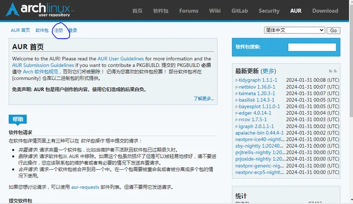
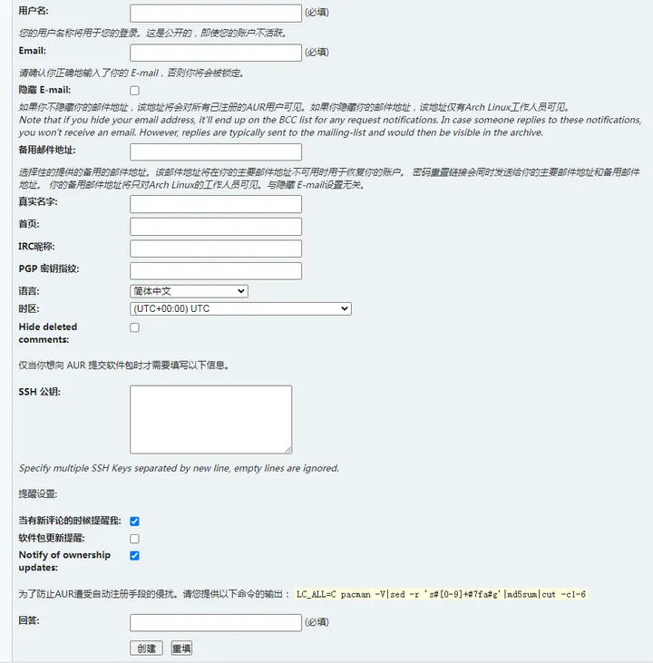
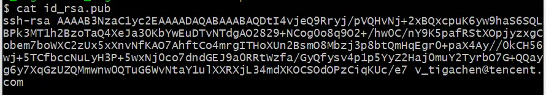
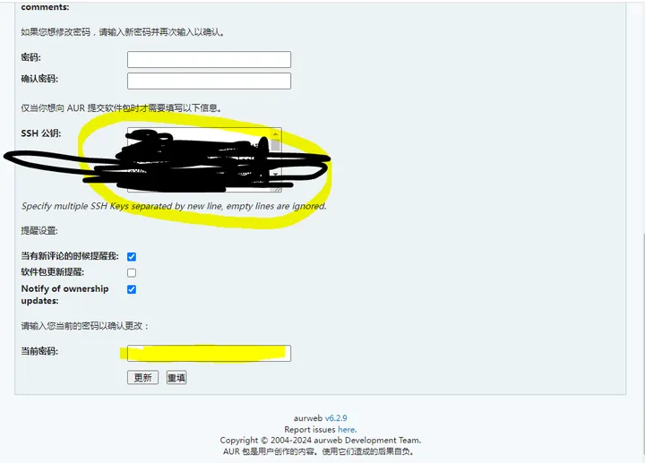
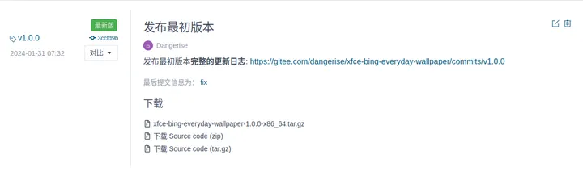
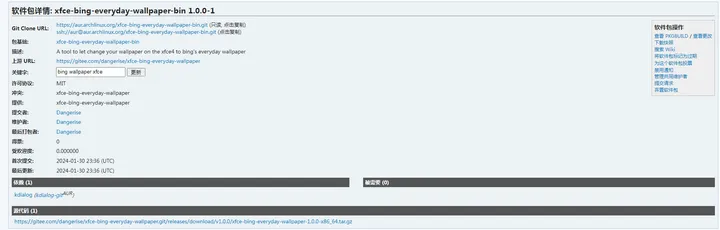
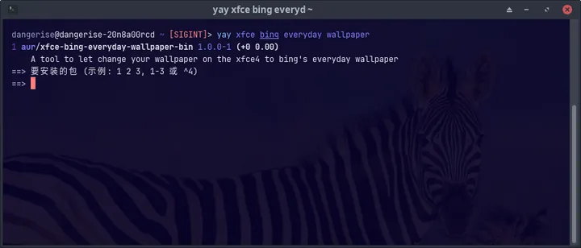

# 前言

众所周知，我们Arch系用户快乐感的来源除了neofetch，还有一个米奇妙妙屋——AUR

AUR丰富的软件生态与AUR helper带来的一键安装方式，使我最终决定使用Arch系的发行版

当你尝试为linux构建了一个软件之后，第一个想的肯定是将它上传到AUR，虽然打包到AUR有些繁琐，但是Rust强大的工具链使之轻而易举。（R门！）

笔者也是刚刚了解如何上传到AUR，如有缺漏，错误，烦请指出

以下将指导你将Rust包发布到AUR上

# 准备工作

## 注册账号

显然，你首先得有一个AUR账号 打开[AUR的网站](https://aur.archlinux.org/)，注册一个账号



创建账号的时候，你只需要填用户名和邮箱地址，然后在最底下的验证填上那些命令的输出，最后点击创建即可



然后你的邮箱会收到一封来自AUR的邮件，你可以通过这个邮件为你的账号添加密码

账号创建成功后，通过这个账号登录到AUR

## SSH公钥 

我们注意到，在创建账号的页面，有SSH公钥一栏，为了上传软件包，我们需要一个SSH公钥

我们先检查本机是否存在SSH公钥

```
cd ~/.ssh
ls
```

我们先进入到这个目录，并查看是否存在id_rsa和id_rsa.pub文件，如果已经存在，就不需要创建

如果不存在，那便需要手动创建SSH key

```
ssh-keygen -t rsa -C "xxx@xxx.com"
```

其中-C参数的内容是注释，建议填写自己的邮箱

创建过程中会询问是否创建口令，视自身需求是否创建

```
cd ~/.ssh
cat id_rsa.pub
```

创建完毕后，进入到ssh的目录，查看id_rsa.pub中的ssh公钥，并复制打印的内容



进入AUR的账号设置，将这串内容填入SSH公钥一栏



将SSH公钥粘贴进去，并在底下输入当前密码，保存修改

# cargo-aur 

AUR中 PKGBUILD 和 .SRCINFO 两个文件分别包含了包的构建信息和包的元属性，我们将使用cargo-aur来生成这两个文件

cargo-aur是一个Rust项目的打包工具，它会自动将你的Rust项目打包成AUR的格式，并且根据Cargo.toml的内容，生成相关文件，所以我们不需要手动编写相关文件

通过cargo安装
```
cargo install cargo-aur
```

通过AUR安装
```
yay -S cargo-aur-bin
```

安装之后，你就可以使用cargo aur这个命令

# 打包

首先你得有一个你将要打包的存储在git仓库中的Rust项目，并且已经远程连接到某个代码托管网站，最好清空了commit

由于cargo aur会根据你的Cargo.toml文件生成AUR的相关文件，所以你需要将Cargo.toml的相关属性填写完整，不然打包的时候会报错，缺少字段

你的项目可能依赖了一些arch的包，可以在Cargo.toml中写明
```
[package.metadata.aur]
depends = ["nachos", "pizza"] # 必要依赖
optdepends = ["sushi", "ramen"] # 可选依赖
```

万事具备，进入到你要打包的crate的根目录，现在开始打包
```
cargo aur
```

完成之后，在target/cargo-aur目录下有两个文件，一个名为PKGBUILD的文件，一个名为
`<包名>-<版本号>-<目标架构>.tar.gz`
的tar包

有关这个包的元数据保存在一个名为 .SRCINFO 的文件中，这个文件需要我们自己用命令生成

进入到target/cargo-aur目录运行以下命令，生成 .SRCINFO文件

```
makepkg --printsrcinfo > .SRCINFO
```

由于这个文件是默认隐藏的，所以你直接用ls命令是不能查看的

为了验证你的包能不能顺利安装，你可以直接运行

```
makepkg
```

在你的系统上安装这个包

如果一切顺利，你可以看到以下信息

```
==> Finished making: <包名> <版本> (<时间>)
```

并且 pkg/<包名> 这个目录会被创建，你可以在里面找到这个包的可执行文件，你可以尝试运行这个可执行文件看看能不能正常工作

# 上传

AUR中不会存储完整的包，只会存储这个包的信息，当你从AUR安装这个包的时候，你会先下载这个包的有关信息，然后根据这些信息再去其他地方下载完整的包

PKGBUILD 和 .SRCINFO 就保存着这个包的相关信息，tar包则是完整的包

所以你需要将 PKGBUILD 和 .SRCINFO 上传到AUR，然后tar包找一个地方存储

cargo-aur要求你将tar包发布到你所远程连接的仓库的发行版中，为了方便国内用户，我上传到了gitee



_注意，这个仓库必须是public的，并且版本号一定要和Cargo.toml中的版本号一致_

当用户从AUR安装时，便会自动从gitee下载最新的发行版并构建

接下来你要将PKGBUILD上传到AUR

请注意，cargo-aur生成的AUR包的名字叫做<Rust包名>-bin，表明这是某个包的二进制版本，而不是从源码构建的版本

那么你要在AUR上创建一个对应的包

```
git clone ssh://aur@aur.archlinux.org/包名-bin.git
```

通过这个命令，直接clone对应的AUR包，如果这个包不存在，AUR会你自动创建一个空的包

（由于是通过ssh下载，如果你在ssh密钥中创建了口令，那么它就会询问这个口令）

现在将上面生成的 PKGBUILD 和 .SRCINFO 文件复制到clone下来的仓库中

通过以下git命令上传

另外，似乎AUR只允许主分支叫 master , 而不能叫其他名字， 如果你的主分支不叫master， 先将主分支重命名为master

```
git add PKGBUILD .SRCINFO
git commit -m "Released version: <version_name>"
git push origin master
```

如果一切顺利，你就可以在AUR上找到你的包了



然后你就可以尝试使用AUR helper安装你的包了

包上传之后可能不会立即生效

附一张成功的截图



<script
  src="https://utteranc.es/client.js"
  repo="Dangerised/blog-issues"
  issue-term="rust-aur"
  theme="github-light"
  crossorigin="anonymous"
  async
>
</script>